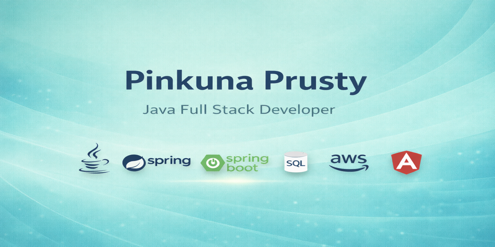

<h1 align="center">Hi 👋, I'm Pinku Prusty</h1>
<h3 align="center">Java | Spring Boot | ReactJS | Microservices | Full-Stack Developer 🚀</h3>

  

  
  

---

## 👨‍💻 About Me
- 💻 Java Full-Stack Developer specializing in **Spring Boot & Microservices**
- ⚛️ Frontend experience with **ReactJS, JavaScript, HTML, CSS, Bootstrap**
- 🗄️ Strong understanding of **SQL, MySQL & Database Design**
- 🔐 Experienced with **JWT Authentication & REST APIs**
- ☁️ Currently exploring **AWS & Docker**
- 🐧 Comfortable working in **Linux environments**
- 🚀 Passionate about building scalable backend applications

---

## 🛠️ Tech Stack

  

---

## 🔥 GitHub Streak

  

---

## 📊 GitHub Stats

  

  

---

## 📫 Connect With Me
- 🔗 GitHub: https://github.com/Pinkuu108  
- 💼 LinkedIn: https://www.linkedin.com/in/pinkuna-prusty-55b487273/

---
